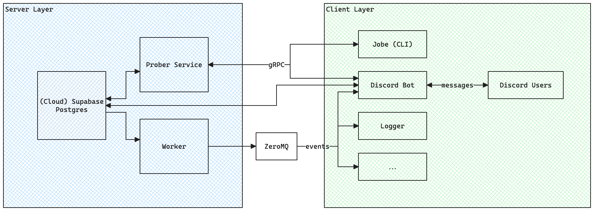

# jobet

Distributed web/API scraping implementation, migrated from [goscrape](https://github.com/maxmwang/goscrape).

New features:
- Pub-sub output: [ZeroMQ](https://zeromq.org/) is the primary form of output for scrape results, decoupling all handlers from the scraping daemon. 
- Priority-rated companies: Higher priority companies are scrapped more frequently, while lower priority are scrapped less frequently. This is implemented to reduce outbound request rate.

## Design

[Excalidraw Link](https://excalidraw.com/#json=E4jhO9eSwll9UDRF99sWG,_dPpJ1r9beuzbokHm3N7-Q).

## Technologies

- [SQLite](https://www.sqlite.org/): Lightweight SQL database
- [gRPC](https://grpc.io/): Lightweight communication between services 
- [ZeroMQ](https://zeromq.org/): Zero-Broker message queue
- [Supabase](https://supabase.com/): Open-source cloud platform
